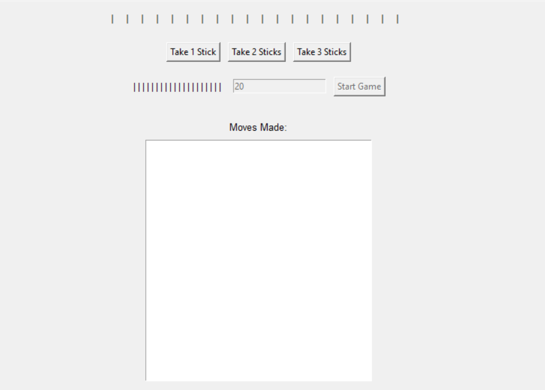
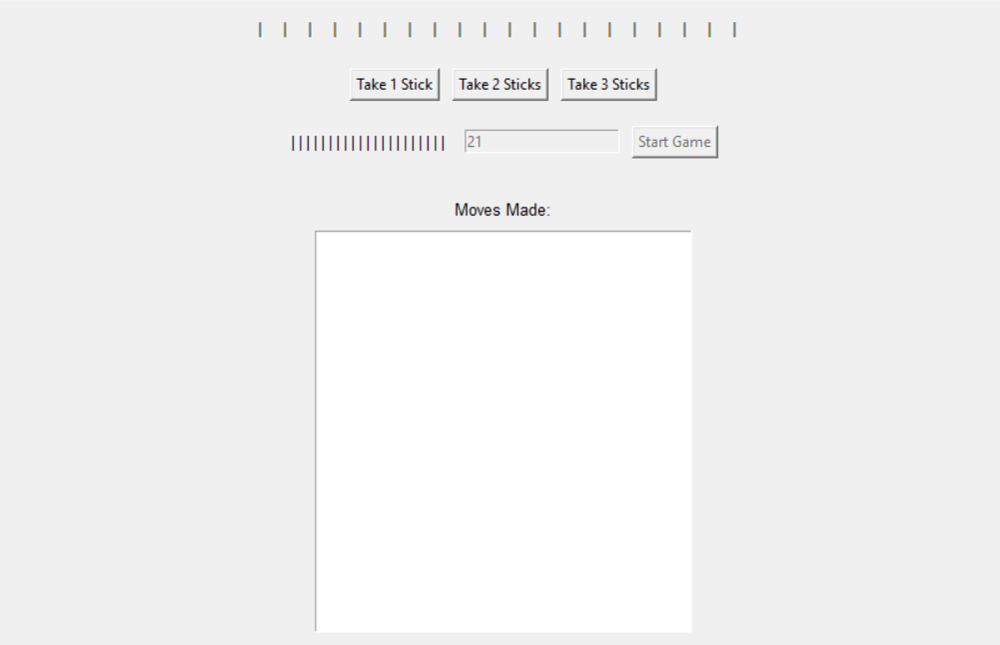
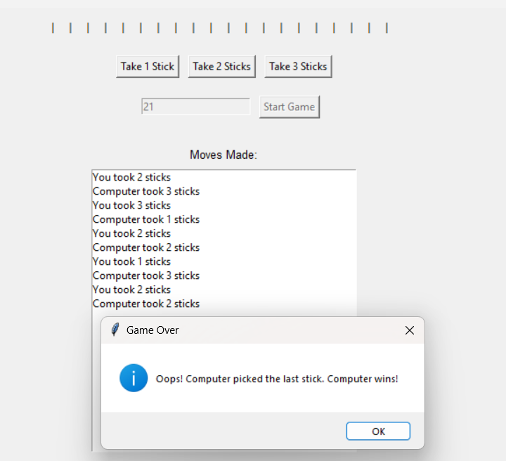

# Introduction to Sprague-Grundy Strategy

The Sprague-Grundy theory, also known as the theory of impartial games, is a mathematical concept used in game theory to analyze and determine optimal strategies in two-player games. It applies to games where players take turns making moves and neither player has an inherent advantage based on the position of the game alone.

## Applying Sprague-Grundy Strategy to Take Away Sticks

In the Take Away Sticks game, players start with a certain number of sticks, and on each turn, a player can choose to remove 1, 2, or 3 sticks. The player who removes the last stick wins the game.

### Calculating Grundy Numbers

1. **Base Cases:**
   - If there are no sticks left (i.e., the game is over), the Grundy number is 0.
   - If there is only one stick left, the Grundy number is 1.

2. **Recursive Calculation:**
   - For any other number of sticks, we calculate the Grundy number based on the Grundy numbers of positions resulting from possible moves.
   - Specifically, for each possible move (1, 2, or 3 sticks), we calculate the Grundy number of the resulting position.
   - The Grundy number of the current position is the smallest non-negative integer that is not equal to the Grundy number of any resulting position.

### Using Grundy Numbers to Determine Moves

Once we have calculated the Grundy numbers for different positions, we can use them to determine the optimal move in any given position. The optimal move is the one that leads to a position with a Grundy number of 0, if possible. If there are no such moves, we can choose any move that leads to a position with the smallest Grundy number.

## Game Theory Principles

The Sprague-Grundy strategy is a key principle of game theory used in this game. It involves assigning numerical values (Grundy numbers) to game positions and using them to determine optimal moves. By calculating Grundy numbers and applying the Sprague-Grundy strategy, players can make informed decisions and strive for victory.

## Implementation in the Game

In the Python implementation of the Take Away Sticks game, the `calculate_grundy` function calculates the Grundy number for a given number of sticks. The `computer_move` function uses the calculated Grundy numbers to determine the computer's move, ensuring it plays optimally according to the Sprague-Grundy strategy.

## How to Play

To play the game, run the provided Python script. You will be prompted to enter the number of sticks to start with. Then, take turns with the computer to remove 1, 2, or 3 sticks until there are no sticks left. The player who removes the last stick wins the game.

## Additional Resources

- **Report PDF:** For further details and analysis, refer to the [report PDF](Report.pdf) included in this repository.

## GUI of the Game

